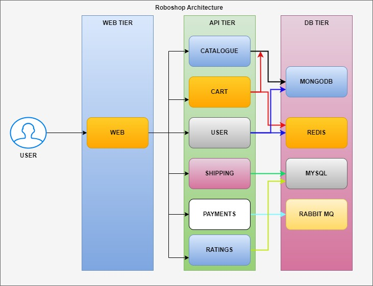

# roboshop-documentation

Below is the communication between components and dependency. This dependency comes from **Development team**. Architects decide that, DevOps has no scope in this.

### WEB TIER:
* Usually web tier is the one which has frontend technologies like HTML, CSS, Java Script (React/Angular/Node).
* We use web server to deploy these kind of applications.
* Earlier Apache Server was popular, Now Nginx is the most popular web server.

### APP TIER:
* APP/API Tier is the one which has backend technologies like Java, .NET, Python, Go, Php, etc.
* Earlier Backend technologies had servers like tomcat, Jboss, IIS, etc.
* Now all backend technologies are coming up with in built servers.
* Usually API tier should not opened through internet, it should be only accessible through web tier.

### DB TIER:
* Storage of the applications will be here like user data, products, orders data, etc.
* We can use RDBMS like MySQL, MSSQL, Postgress, etc for row and column based data.
* We can use NoSQL databases like MongoDB for storing the product information.
* We can use Cache servers like Redis to access the data with lightening speed.
* We can use MQ Servers like RabbitMQ, ActiveMQ, Kafka, etc for asynchronous communication.