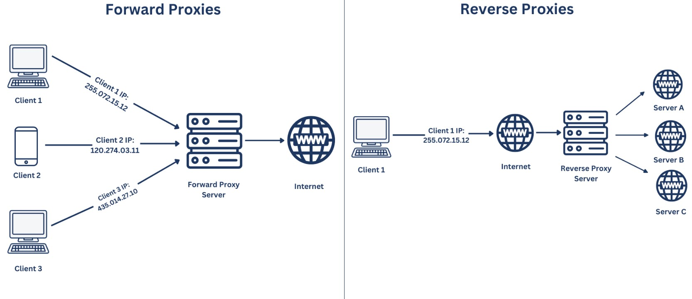

### Nginx
We officially pronounce it as **Engine-X**

* It is popular web server.
* It is popular reverse-proxy server.

### Directory Structure:
1. Nginx configuration is available in
```
/etc/nginx
```
2. By default HTML files are available in
```
/usr/share/nginx/html
```
3. Logs are available in
```
/var/log/nginx
```
4. Main configuration file is
```
/etc/nginx/nginx.conf
```

We have 2 type of proxies.
1. Forward Proxy
2. Reverse Proxy



#### Forward Proxy:
* Client-Centric: Client is aware of existence of proxy, we intentionally send the traffic through proxy server.
* Privacy and Anonymous: Forward proxy is used to hide the client IP address.
* Content Filtering and Access Control: We can restrict traffic out of the network through proxy.
* Caching: Frequently requested content can be cached here.

#### Reverse Proxy:
* Server-Centric: Clients are unaware of the existence of reverse proxy, for clients it the website they are connecting.
* Load Balancing: Reverse proxies have load balancing capabilities.
* Security: Reverse proxy servers are the best for security. They protect the backend server programming and their IP addresses.
* SSL Termination: Reverse proxies can handle SSL/TLS encryption and decryption, relieving the backend servers from this resource-intensive task.